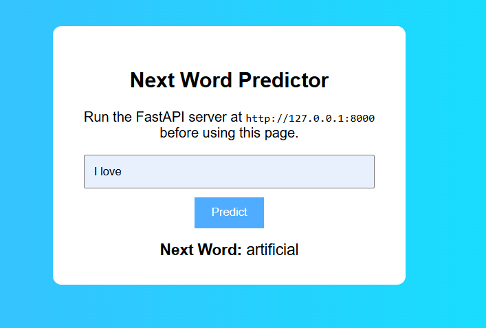

# Assignment No. 5: LSTM-Based Sequence Prediction System

## Project Overview
This project implements a next-word prediction system using an LSTM model built with TensorFlow and Keras. The model is trained on text data from an open dataset and deployed using FastAPI for real-time predictions.

## Group Details
| # | Full Name | PRN |
|---|-----------|-----|
| 1 | Chetanraje Gund | 202301040090 |
| 2 | Abhinav Badhe | 202301040100 |
| 3 | Omkar Waghmare | 202301040010 |
| 4 | Virendra Pandule | 202301040078 |

## GitHub Repository
https://github.com/chetanraje27/Deep-Learning-Assignments/tree/main/Assignment_No_5_LSTM

## Files Included
- `DL_Assignment_5.ipynb` - Notebook containing dataset collection, preprocessing, model development, prediction tests, and deployment notes.
- `main.py` - FastAPI application exposing the `/predict` endpoint.
- `index.html` - Simple front-end UI for entering input text and displaying predictions.
- `model.h5` - Saved Keras model file.
- `tokenizer.pkl` - Saved tokenizer object for text preprocessing.
- `max_len.pkl` - Saved sequence length used for padding.
- `requirements.txt` - List of Python dependencies.
- `Output.png` - Result screenshot showing the prediction output.
- `README.md` - Project documentation.

## Dataset
- **Source:** Project Gutenberg
- **Text used:** "Alice's Adventures in Wonderland" (excerpt)
- **URL:** https://www.gutenberg.org/files/11/11-0.txt
- **Description:** A cleaned and trimmed text excerpt from the novel used for training the LSTM model.

## Preprocessing Steps
1. Download raw text from Project Gutenberg.
2. Remove header/footer and normalize line breaks.
3. Split text into sentences.
4. Tokenize sentences into word indices.
5. Create n-gram sequences for next-word prediction.
6. Pad sequences to uniform length.
7. One-hot encode target labels.

## Model Development
- Embedding layer for word representations.
- LSTM layer to learn sequence patterns.
- Dense output layer with softmax activation for next-word prediction.
- Loss function: `categorical_crossentropy`.
- Optimizer: `adam`.

## Deployment
The FastAPI app provides a REST endpoint:
- `POST /predict`
- Request format:
  ```json
  {
    "text": "I love"
  }
  ```
- Example response:
  ```json
  {
    "input": "I love",
    "next_word": "artificial"
  }
  ```

## Setup Instructions
1. Install dependencies:
   ```bash
   pip install -r requirements.txt
   ```
2. Start the FastAPI server:
   ```bash
   uvicorn main:app --reload
   ```
3. Open `index.html` in a browser.
4. Enter text and click "Predict" to see the next word.

## Output Screenshot


## Notes
- The notebook includes both model training and deployment documentation.
- This project satisfies the assignment requirements for LSTM model development, sequence prediction, and FastAPI deployment.
